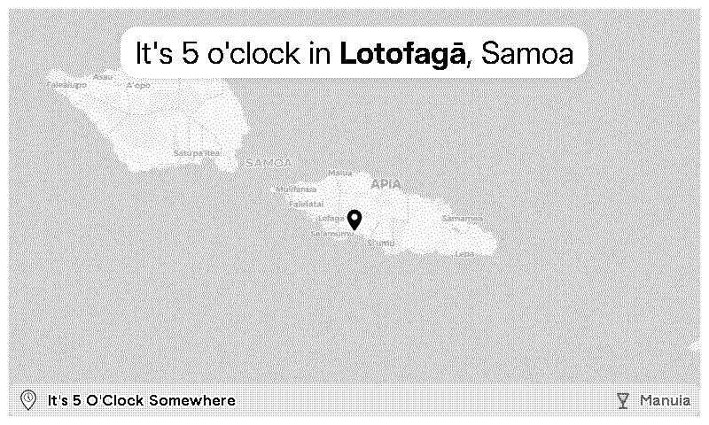

# trmnl-its5oclock-somewhere-plugin

TRMNL plugin that displays a random city where it's currently 5 o'clock somewhere.

<!-- PLUGIN_STATS_START -->
##  [It's 5 O'Clock Somewhere](https://trmnl.com/recipes/253752)

 

### Description
Discover a new city around the world where it's exactly 5 PM. A live map shows you just where to raise your glass, because <strong>it's always 5 o'clock somewhere!</strong>  glass by Leonardo Henrique Martini from <a href="https://thenounproject.com/browse/icons/term/glass/" target="_blank" title="glass Icons">Noun Project</a> (CC BY 3.0) Beer by Massfoday K Toure from <a href="https://thenounproject.com/browse/icons/term/beer/" target="_blank" title="Beer Icons">Noun Project</a> (CC BY 3.0) 

---

<!-- PLUGIN_STATS_END -->